# 视频教程

https://www.bilibili.com/video/BV19F41zPEnM/
# 流程

RVC：训练角色音色模型

Replay：利用音色模型+原曲进行AI翻唱

UVR&MSST：进行人声伴奏分离

# 准备音源

至少10分钟，推荐1小时。音频内仅允许有一种音色，可以有停顿，如果想要更高质量可以自己裁剪停顿处

# 利用RVC训练模型

进入 [RVC-Project/Retrieval-based-Voice-Conversion-WebUI: Easily train a good VC model with voice data <= 10 mins!](https://github.com/RVC-Project/Retrieval-based-Voice-Conversion-WebUI) 根据你的系统和显卡来进行下载，或者使用该链接下载（国内高速） [语音克隆&变声器 整合包下载](https://www.yuque.com/flowercry/hxf0ds) 注意不要下错了

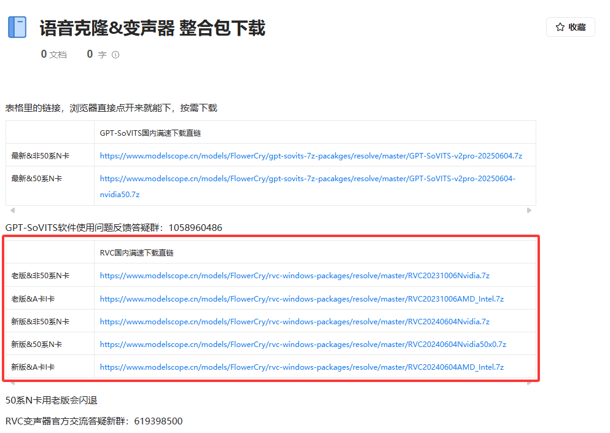

直接运行 `go-web.bat`

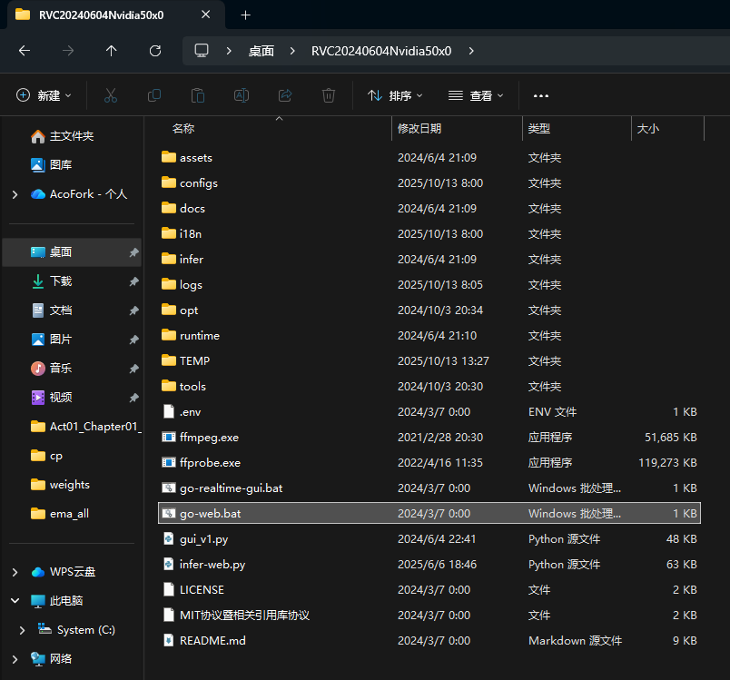

进入 WebUI 并切换到训练一栏

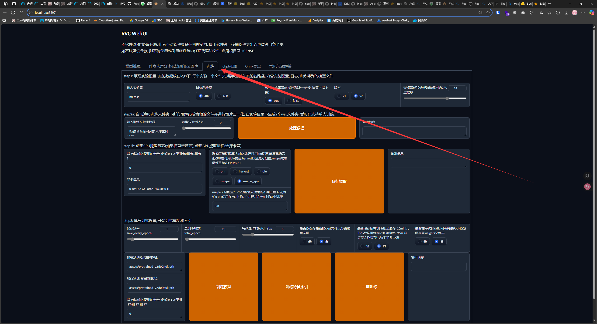

首先写模型名称

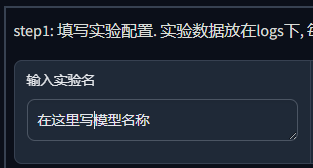

然后将你的音源放到一个空文件夹

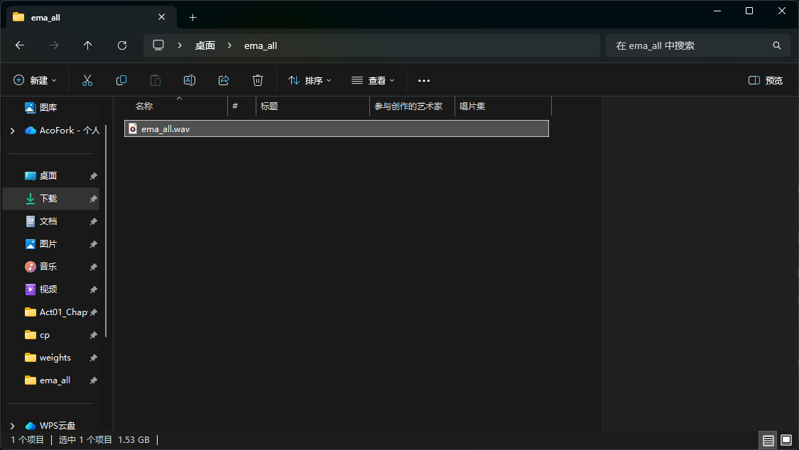

然后填进去

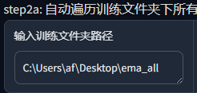

总训练轮数推荐50 ~ 200

然后点击一键训练（需要很久，建议晚上睡觉前训练）

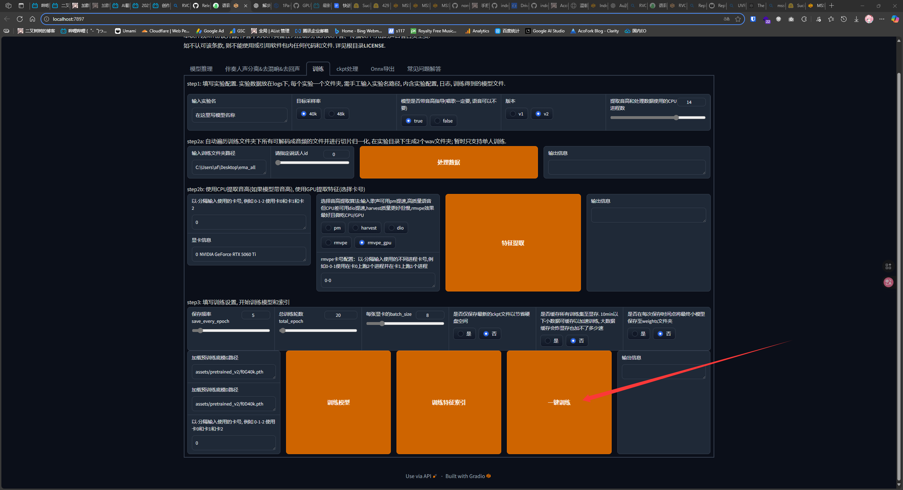

训练结束后可以在 `assets/weights` 找到模型文件， `.pth` 结尾的

# 利用Replay做AI翻唱

下载 [Replay](https://www.weights.com/replay)

首先 **Select Audio** 选择你的原歌曲

**Model** 选择刚刚训练出的模型

然后点击 **Convert Audio** 

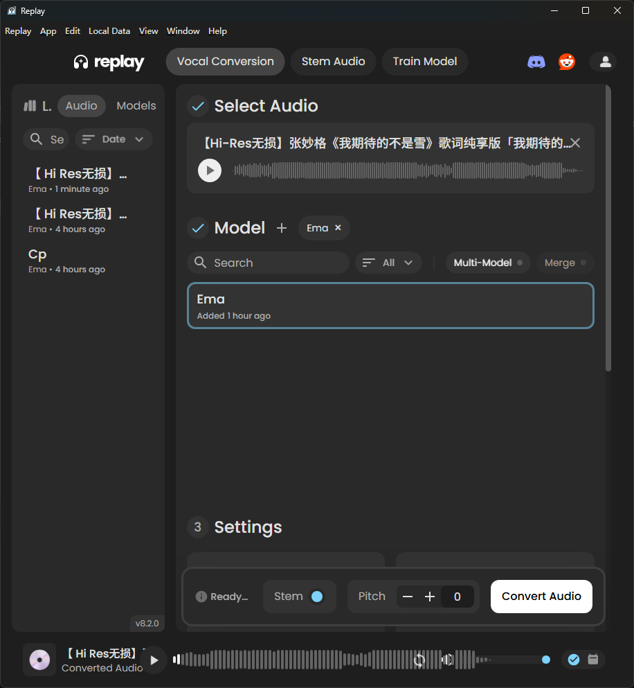

在输出的文件的 **View in Folder** 可以找到 **干净的AI人声** 

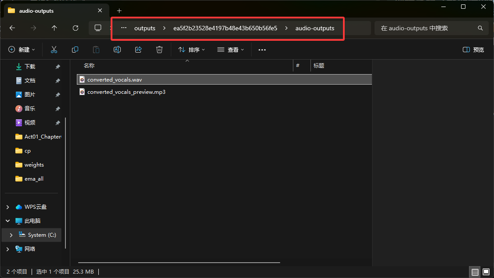

# 伴奏和人声分离

### UVR

> 如果你是50系显卡请前往[GPU Acceleration Hangs on RTX 5070Ti (Driver 576.80, CUDA 12.9) · Issue #1889 · Anjok07/ultimatevocalremovergui](https://github.com/Anjok07/ultimatevocalremovergui/issues/1889)通过[UVR_Patch_4_24_25_20_11_BETA_full_cuda_12.8](https://www.mediafire.com/file_premium/4jg10r9wa3tujav/UVR_Patch_4_24_25_20_11_BETA_full_cuda_12.8.zip/file)下载适用于50系显卡的UVR

下载 [Anjok07/ultimatevocalremovergui: GUI for a Vocal Remover that uses Deep Neural Networks.](https://github.com/Anjok07/ultimatevocalremovergui)

首先下载模型，选择设置

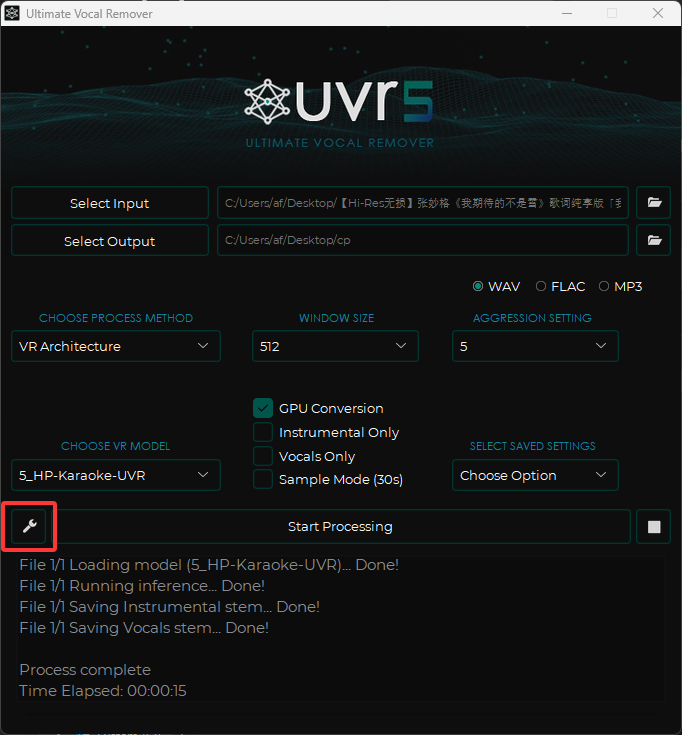
选择 **Download Center** 下载 **VR  Arch** 的 **5_HP-Karaoke-UVR** 模型。然后回到首页
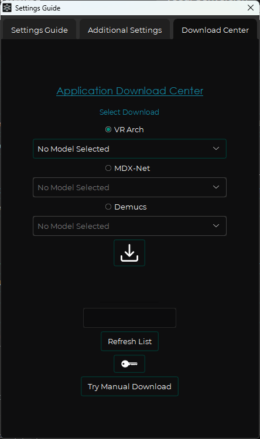

首先通过 **Select Input** 选择原音频

然后通过 **Select Output** 选择输出的文件夹

**CHOOSE PROCESS METHOD** 选择 **VR Architecture** 

**CHOOSE VR MODEL** 选择我们刚刚下载的 **5_HP-Karaoke-UVR** 模型

勾选 **GPU Conversion** 

然后点击 **Start Processing** 

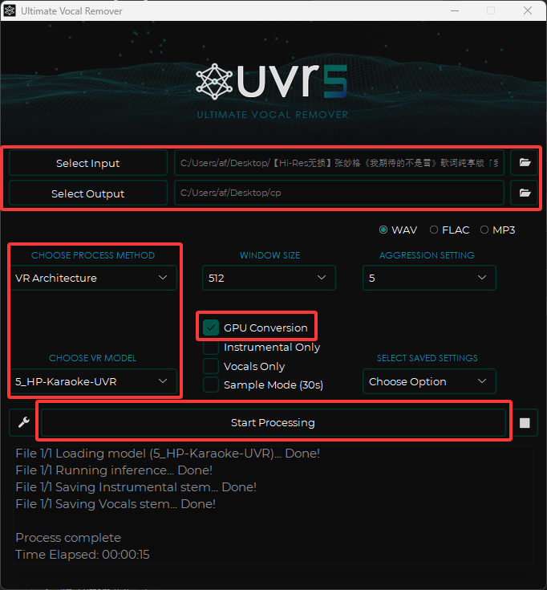

输出文件夹中 **Instrumental** 为伴奏， **Vocals** 为人声

### MSST

下载 [SUC-DriverOld/MSST-WebUI: A WebUI app for Music-Source-Separation-Training and we packed UVR together!](https://github.com/SUC-DriverOld/MSST-WebUI)

双击 `go-webui.bat` 运行

首先去安装模型。每个模型的最终输出文件可能不一样

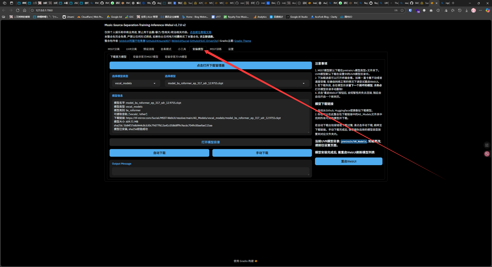

然后都是字面意思了，随后点击 **输入音频分离** 开始转换

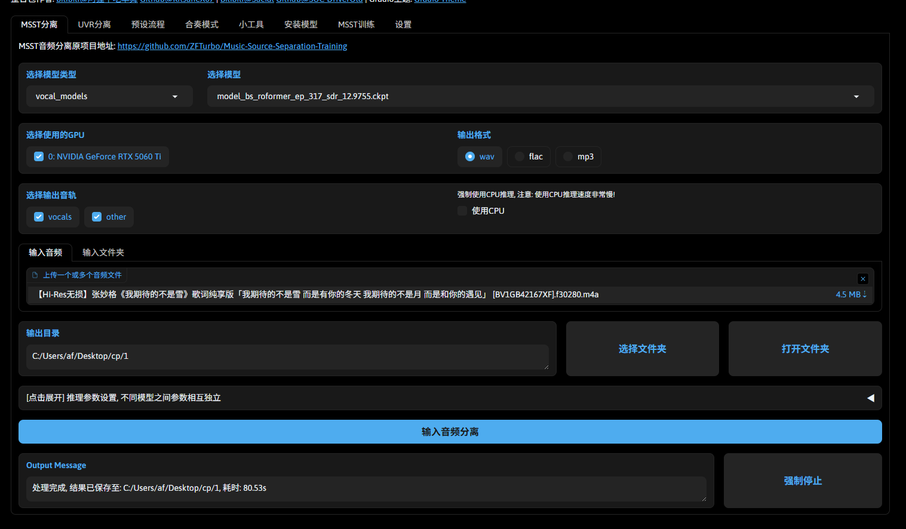